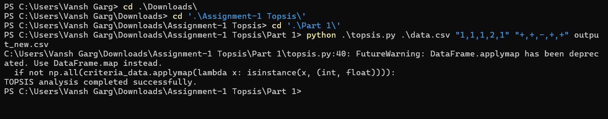
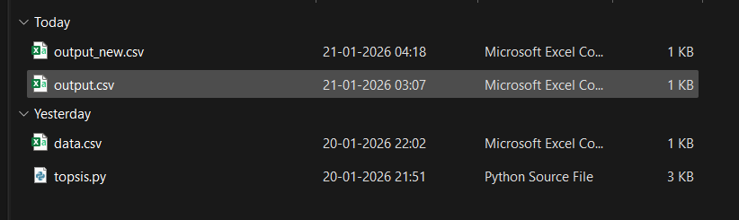
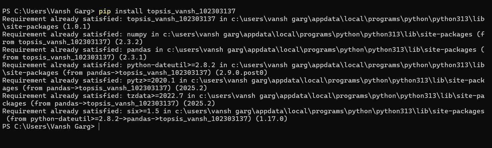
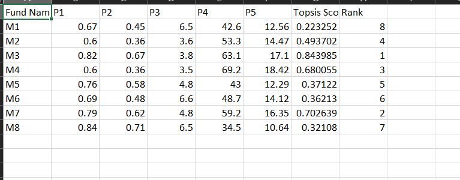
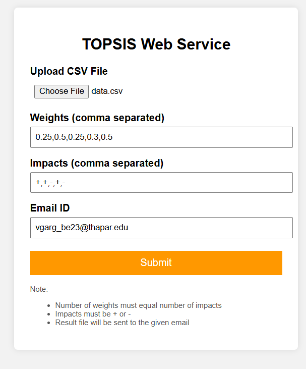
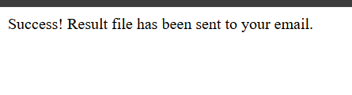
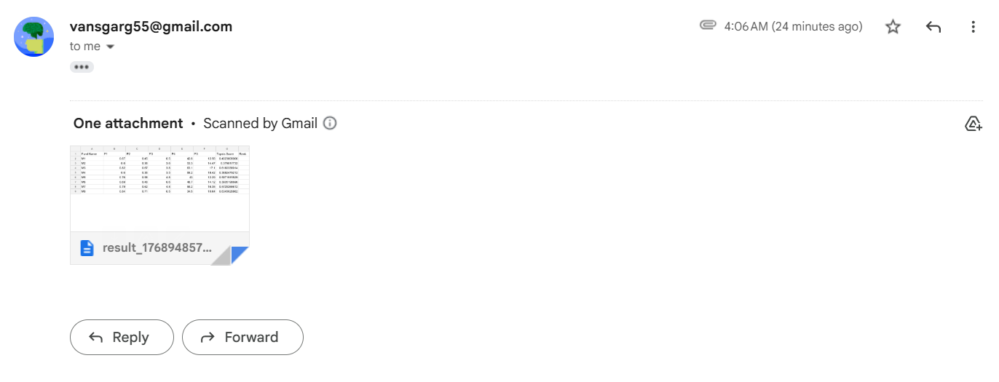

TOPSIS ASSIGNMENT – COMPLETE WORK (PART I, II & III)

Course: UCS654
Student Name: Vansh Garg
Roll No: 102303137
Group: 3C15

PART – I : IMPLEMENTATION OF TOPSIS ALGORITHM
--------------------------------------------------

Objective:
To implement the Technique for Order Preference by Similarity to Ideal Solution (TOPSIS) for solving Multiple Criteria Decision Making (MCDM) problems.

Description:
In this part, the TOPSIS algorithm was implemented to rank alternatives based on multiple criteria. The algorithm normalizes the decision matrix, applies weights, calculates ideal best and worst solutions, computes distances, and assigns ranks based on relative closeness.

Input:
- CSV file
- Weights vector
- Impacts vector (+ or -)

Output:
- TOPSIS Score
- Rank for each alternative

Result:
The algorithm correctly ranked alternatives based on given criteria and weights.

PART I PROOF

Output_new.csv file is added.

PART – II : PYTHON PACKAGE CREATION & PYPI UPLOAD
--------------------------------------------------

Objective:
To develop a reusable Python package for TOPSIS and upload it to PyPI.

Package Name:
topsis_vansh_102303137

Description:
A Python package was created to solve MCDM problems using TOPSIS. The package works as a command-line tool and accepts CSV input, weights, and impacts to generate a ranked output CSV file.

Installation:
pip install topsis_vansh_102303137

Command Line Usage:
topsis <input_file.csv> <weights> <impacts>

Example:
topsis sample.csv "0.25,0.25,0.25,0.25" "+,+,-,+"

Input Format:
- CSV file
- First column: Alternative names
- Remaining columns: Numeric criteria only

Output:
- CSV file containing:
  - Topsis Score
  - Rank

Testing Proof:
1. Package installed using pip

2. CLI command executed successfully

3. Output CSV generated with correct ranks

PyPI Proof:
The package is publicly available on PyPI and installable using pip.
Package Link - https://pypi.org/project/topsis-vansh-102303137/1.0.1/

PART – III : WEB SERVICE USING OWN PYPI PACKAGE
--------------------------------------------------

Objective:
To develop a web service that uses the TOPSIS Python package to process user input and send results via email.

Technology Stack:
- Python
- Flask
- HTML
- Gmail SMTP
- PyPI package (Part II)

Features:
- CSV file upload
- Input of weights and impacts
- Email validation
- TOPSIS computation using own PyPI package
- Result sent via email as CSV attachment

Working Flow:
1. User uploads CSV file via web form
2. User enters weights, impacts, and email
3. Inputs are validated
4. TOPSIS is executed using CLI invocation of the PyPI package
5. Output CSV is generated
6. Result file is emailed to the user

Folders Used:
uploads/
- Stores uploaded input CSV files

outputs/
- Stores generated TOPSIS result CSV files

Email Functionality:
- Gmail SMTP with TLS
- App Password used (not Gmail password)
- Result CSV sent as email attachment

Testing Proof:
1. Flask web app executed successfully
2. CSV uploaded via browser
3. Validations performed correctly
4. Output file generated
5. Email received with attached result CSV

Command to Run Web App:
python app.py

URL:
http://127.0.0.1:5000/

